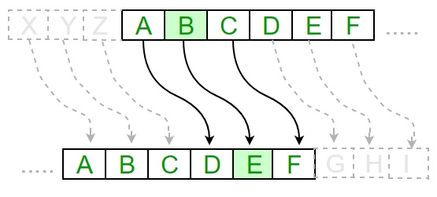
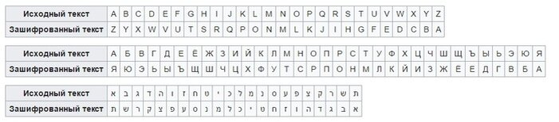

---
## Front matter
lang: ru-RU
title: Лабораторная работа №1
subtitle: Шифры простой замены
author:
  - Кубасов В.Ю., ст.б. 1132249516
date: 12 сентября 2024

## i18n babel
babel-lang: russian
babel-otherlangs: english

## Formatting pdf
toc: false
toc-title: Содержание
slide_level: 2
aspectratio: 169
section-titles: true
theme: metropolis
header-includes:
 - \metroset{progressbar=frametitle,sectionpage=progressbar,numbering=fraction}

## Fonts
mainfont: IBM Plex Serif
romanfont: IBM Plex Serif
sansfont: IBM Plex Sans
monofont: IBM Plex Mono
mathfont: STIX Two Math
mainfontoptions: Ligatures=Common,Ligatures=TeX,Scale=0.94
romanfontoptions: Ligatures=Common,Ligatures=TeX,Scale=0.94
sansfontoptions: Ligatures=Common,Ligatures=TeX,Scale=MatchLowercase,Scale=0.94
monofontoptions: Scale=MatchLowercase,Scale=0.94,FakeStretch=0.9
mathfontoptions:
---


# Вводная часть

## Цели и задачи

### Цель работы:    

Ознакомиться с элементарными методами шифрования на примере шифров простой замены

### Задачаи работы:

- Реализовать шифр Цезаря
- Реализовать шифр Атбаш

# Теоретическое введение

Шифр подстано́вки — это метод шифрования, в котором элементы исходного открытого текста заменяются зашифрованным текстом в соответствии с некоторым правилом

# Реализация

## Шифр Цезаря    

{height=35%}

__Шифр Цезаря__ — это вид шифра подстановки, в котором каждый символ в открытом тексте заменяется символом, находящимся на некотором постоянном числе позиций левее или правее него в алфавите. Например, в шифре со сдвигом вправо на 3, А была бы заменена на Г, Б станет Д, и так далее . Величину _сдвига_ можно рассматривать как ключ шифрования.

## Шифр Цезаря

```julia 
function gimmePassword()
    println("Введите смещение");

    offset = parse(Int64, readline());
    trueOffset = mod(offset, smallZOrd - smallAOrd + 1);
    rawPassword = "";

    for i in smallAOrd:1:smallZOrd
        rawPassword = rawPassword * (Char)(i);
    end;

    password = rawPassword[trueOffset + 1:length(rawPassword)]
         * rawPassword[1:trueOffset];
    return password;
end;
```

## Шифр Атбаш

    

__Шифр Атбаш__ основан на _инверсии_ алфавита: первая буква заменяется последней, вторая — предпоследней и так далее. В английском алфавите A меняется на Z, B на Y и так далее.

## Шифр Атбаш

```julia
function gimmePassword()
    rawPassword = "";

    for i in smallAOrd:1:smallZOrd
        rawPassword = rawPassword * (Char)(i);
    end;

    password = reverse(rawPassword * ' ');

    return password;
end;
```

# Вывод

- Изучили элементарные виды шифрования, такие как алфавитные подстановки.
- Реализовали шифры алфавитных подстановок на примере шифра Цезаря и Атбаш.

