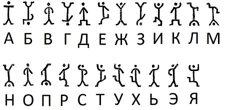

---
## Front matter
title: "Лабораторная работа №1"
subtitle: "Шифры простой замены"
author: "Кубасов В.Ю., ст.б. 1132249516"

## Generic otions
lang: ru-RU
toc-title: "Содержание"

## Bibliography
bibliography: bib/cite.bib
csl: pandoc/csl/gost-r-7-0-5-2008-numeric.csl

## Pdf output format
toc: true # Table of contents
toc-depth: 2
lof: true # List of figures
lot: true # List of tables
fontsize: 12pt
linestretch: 1.5
papersize: a4
documentclass: scrreprt
## I18n polyglossia
polyglossia-lang:
  name: russian
  options:
	- spelling=modern
	- babelshorthands=true
polyglossia-otherlangs:
  name: english
## I18n babel
babel-lang: russian
babel-otherlangs: english
## Fonts
mainfont: IBM Plex Serif
romanfont: IBM Plex Serif
sansfont: IBM Plex Sans
monofont: IBM Plex Mono
mathfont: STIX Two Math
mainfontoptions: Ligatures=Common,Ligatures=TeX,Scale=0.94
romanfontoptions: Ligatures=Common,Ligatures=TeX,Scale=0.94
sansfontoptions: Ligatures=Common,Ligatures=TeX,Scale=MatchLowercase,Scale=0.94
monofontoptions: Scale=MatchLowercase,Scale=0.94,FakeStretch=0.9
mathfontoptions:
## Biblatex
biblatex: true
biblio-style: "gost-numeric"
biblatexoptions:
  - parentracker=true
  - backend=biber
  - hyperref=auto
  - language=auto
  - autolang=other*
  - citestyle=gost-numeric
## Pandoc-crossref LaTeX customization
figureTitle: "Рис."
tableTitle: "Таблица"
listingTitle: "Листинг"
lofTitle: "Список иллюстраций"
lotTitle: "Список таблиц"
lolTitle: "Листинги"
## Misc options
indent: true
header-includes:
  - \usepackage{indentfirst}
  - \usepackage{float} # keep figures where there are in the text
  - \floatplacement{figure}{H} # keep figures where there are in the text
---

# Цель работы

Ознакомиться с простейшим и древнейшим вариантом шифрования, как метода защиты передаваемой информации - алфавитными перестановками

# Задание

Реализовать 2 шифра:
- Шифр цезаря
- Шифр Атбаш 

# Теоретическое введение

Шифр Цезаря - первый документированный европейский шифр. Является шифром [__простой замены__][1].
</br>Основным назначением шифрования ялвяется защита информации от третьих лиц. Так, например, данный шифр был разработан для безопасной передачи сообщений послами. Используя шифрование исходного письма, гарантировалась недоступность государственной информации, а также однозначное определение смысла послания после получения письма нужным лицом.
</br>Аналогичным шифром, относящимся к данному классу является шифр Атбаш, где использовался "перевернутый" алфавит.
</br>Пусть сейчас данные шифры являются устаревшими и взлом их осуществляется разными методами, они положили основу криптографии.

</br> Взлом данных шифров осуществляется __частотным анализом__. Частнотный анализ требует значительной подготовки и [большой выборки сообщений][2], совпадающих по языку с зашифрованным сообщением. Противоядием к частнотному анализу может быть банальное несоблюдение норм языка (нарушение орфографии ведёт к искажению частот появления букв в сообщении, например, бука "о" перестанет встречаться в 45 раз чаще буквы "ф"), либо вставкой лишних символов, не несущих в себе информации.
</br> Помимо частотного анализа в настоящее время является возможным использование __bruteforce-метода__ - метода грубой силы или полного перебора.


# Выполнение лабораторной работы

Ввиду того, что шифрование является заменой одного символа на другой, можно выделить несколько вариантов реализации шифра Цезаря и Атбаш:
1. Путём создания хэш-таблицы, где ключ - исходный символ, а значение в паре KeyValuePair - зашифрованным символом.
2. Создание строки str с итоговым шифром, где индекс i - порядковый номре исходного символа в алфавите, а str[i] - зашифрованный символ. 

Был реализован 2ой вариант, тогда функция, создающая нужную шифровальную строку со смещением offset выглядит как:
```
function gimmePassword()
    println("Введите смещение");
    offset = parse(Int64, readline());

    trueOffset = mod(offset, smallZOrd - smallAOrd + 1);

    rawPassword = "";

    for i in smallAOrd:1:smallZOrd
        rawPassword = rawPassword * (Char)(i);
    end;

    password = rawPassword[trueOffset + 1:length(rawPassword)] * rawPassword[1:trueOffset];

    return password;
end;
```

Аналогично для Атбаш шифра:
```
function gimmePassword()
    rawPassword = "";

    for i in smallAOrd:1:smallZOrd
        rawPassword = rawPassword * (Char)(i);
    end;

    password = reverse(rawPassword * ' ');

    return password;
end;
```
где переменная _password_ - результирующая "шифровальная" строка, а константы smallAOrd, bigZOrd - начала и концы алфавита (в прописном и строчном варианте):

```
const smallAOrd = codepoint('a');
const smallZOrd = codepoint('z');

const bigAOrd = codepoint('A');
const bigZOrd = codepoint('Z');
```

Далее полученная в функции строка (в нижнем регистре) копируется в верхний регистр для шифрования строчных и прописных букв:

```
lowerCasePassword = gimmePassword();
upperCasePassword = uppercase(lowerCasePassword);
```

Далее ожидаем на вход строку от пользователя для шифрования (с заданным смещением для шифра Цезаря или без дополнительных входных данных для шифра Атбаш):

```
println("Введите строку для шифрования");
unshieldedString = readline();

shieldedString = "";
```
где _unshieldedStirng_ - незашифрованная строка, а _shieldedString_ - зашифрованная (введена для задания типа переменной).
</br> Далее необходимо посимвольно итерироваться по незашифрованной строке, выбирая по номеру буквы в алфавите соответствующий символ из шифровальной строки:

```
for i in 1:1:length(unshieldedString)
    if (occursin(unshieldedString[i], lowerCasePassword))
        global shieldedString = shieldedString * lowerCasePassword[codepoint(unshieldedString[i]) - smallAOrd + 1];
    elseif (occursin(unshieldedString[i], upperCasePassword))
        global shieldedString = shieldedString * upperCasePassword[codepoint(unshieldedString[i]) - bigAOrd + 1];
    else
        global shieldedString = shieldedString * unshieldedString[i];
    end;
end;

```

По итогу двух алгоритмов получаем _shieldedString_, содержащую зашифрованное сообщение, после чего выводим его на экран.

Пример консольного вывода для шифра Цезаря со смещением 5:
```
Введите смещение
5
Введите строку для шифрования
Hi, I'm truly Caesar!
Mn, N'r ywzqd Hfjxfw!
```

# Выводы

1. Ознакомились с простейшими видами шифрования на прмиере шифра Цезаря и шифра Атбаш.
2. Реализовали данные шифры на языке Julia
3. Выявили слабые и сильные стороны подобных шифров

# Список литературы{.unnumbered}

::: {#refs}
:::
