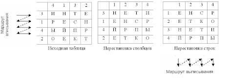
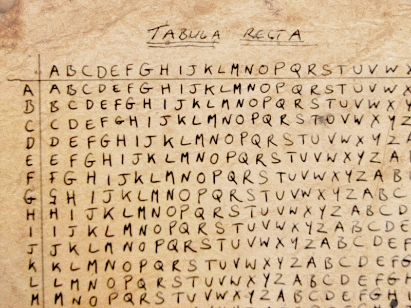

---
## Front matter
lang: ru-RU
title: Лабораторная работа №2
subtitle: Шифры перестановки
author:
  - Кубасов В.Ю.

## i18n babel
babel-lang: russian
babel-otherlangs: english

## Formatting pdf
toc: false
toc-title: Содержание
slide_level: 2
aspectratio: 169
section-titles: true
theme: metropolis
header-includes:
 - \metroset{progressbar=frametitle,sectionpage=progressbar,numbering=fraction}

## Fonts
mainfont: IBM Plex Serif
romanfont: IBM Plex Serif
sansfont: IBM Plex Sans
monofont: IBM Plex Mono
mathfont: STIX Two Math
mainfontoptions: Ligatures=Common,Ligatures=TeX,Scale=0.94
romanfontoptions: Ligatures=Common,Ligatures=TeX,Scale=0.94
sansfontoptions: Ligatures=Common,Ligatures=TeX,Scale=MatchLowercase,Scale=0.94
monofontoptions: Scale=MatchLowercase,Scale=0.94,FakeStretch=0.9
mathfontoptions:
---

# Вводная часть

## Актуальность

- Шифры перестановки используются до сих пор
- Перестановочные алгоритмы лежат в основе современного шифрования

## Цели и задачи

- Ознакомиться с перестановочными и многоалфавитными шифрами
- Реализовать предложенные шифры

# Выполнение работы

## Маршрутные шифры



## Маршрутные шифры

```julia
println("Введите пароль");
pass = lowercase(readline());
sortedPass = join(sort(collect(pass)));

numberOfColumn = [];
lengthOfPass = length(pass);

for i in 1:2:length(sortedPass) * 2
    push!(numberOfColumn, (Int64)
      ((findfirst(sortedPass[i], pass) - 1) / 2 + 1));
end;
```

## Маршрутные шифры

```julia
println("Строку к шифрованию (без пробелов и других символов кроме кириллицы)");
rawString = lowercase(readline());

encodedString = "";

numberOfRaws = ceil(length(rawString) / lengthOfPass);

while length(rawString) < (numberOfRaws * lengthOfPass)
    global rawString *= 'а'; # заглушка для количества символов
end;
```

## Маршрутные шифры

```julia
for i in numberOfColumn
    current = i;
    while (current <= length(rawString))
        global encodedString *= rawString[2 * current - 1];
        current += lengthOfPass;
    end;
end;

println(encodedString);
```

## Шифр Виженера

 {height=70%}

## Шифр Виженера

 ```julia
const abcStart = codepoint('а');
const abcEnd = codepoint('я');

println("Введите пароль");
pass = lowercase(readline());

# Работает при условии только кириллицы, без других символов
println("Введите строку для шифрования");
rawString = lowercase(readline());

encodedString = "";
 ```

## Шифр Виженера

 ```julia

while (length(pass) < length(rawString))
    global pass *= pass;
end;

for i in 1:2:2 * length(rawString)
    global encodedString *= (Char)(abcStart - 1 + 
        mod(codepoint(rawString[i]) + 
            codepoint(pass[i]) - 2 * abcStart + 1, abcEnd - abcStart)); 
end;

println(encodedString);
 ```

# Выводы

1. Познакомились с многоалфавитными шифрами и шифрами перестановок
2. Реализовали маршрутный шифр и шифр Виженера

