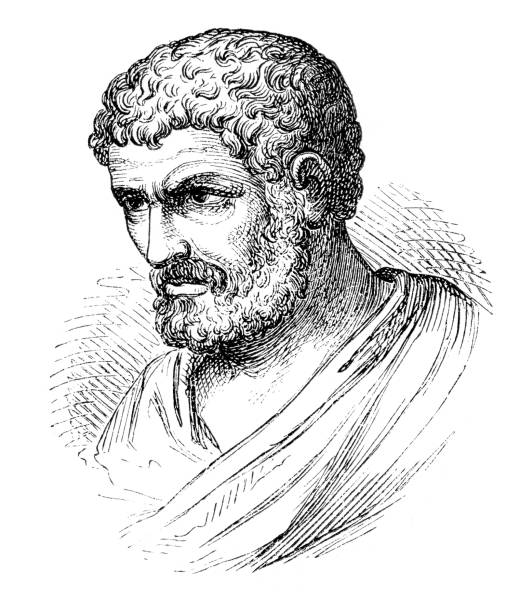

---
## Front matter
lang: ru-RU
title: Лабораторная работа №4
subtitle: Вычисление наибольшего общего делителя
author:
  - Кубасов В.Ю.

## i18n babel
babel-lang: russian
babel-otherlangs: english

## Formatting pdf
toc: false
toc-title: Содержание
slide_level: 2
aspectratio: 169
section-titles: true
theme: metropolis
header-includes:
 - \metroset{progressbar=frametitle,sectionpage=progressbar,numbering=fraction}

## Fonts
mainfont: IBM Plex Serif
romanfont: IBM Plex Serif
sansfont: IBM Plex Sans
monofont: IBM Plex Mono
mathfont: STIX Two Math
mainfontoptions: Ligatures=Common,Ligatures=TeX,Scale=0.94
romanfontoptions: Ligatures=Common,Ligatures=TeX,Scale=0.94
sansfontoptions: Ligatures=Common,Ligatures=TeX,Scale=MatchLowercase,Scale=0.94
monofontoptions: Scale=MatchLowercase,Scale=0.94,FakeStretch=0.9
mathfontoptions:
---

# Вводная часть

## Актуальность

- Алгоритм Евклида применяется в широком спектре задач, а также является одним из немногих оптимальных алгоритмов нахождения НОД.
- Алгоритм Евклида используется в множестве других математических алгоритм (например, нахождение НОК).

## Цели и задачи

Реализовать предложенные вариации алгоритма Евклида:
- Алгоритм Евклида
- Бинарный алгоритм Евклида
- Расширенный алгоритм Евклида
- Расширенный бинарный алгоритм Евклида

# Выполнение работы

## Маршрутные шифры



## Алгоритм Евклида
<div style="font-size: 12px">

```julia
println("Введите а");
a = parse(Int, chomp(readline()));
println("Введите b");
b = parse(Int, chomp(readline()));

ri_1 = a; ri = b; i = 1;

while (true) 
    riplus1 = ri_1 % ri;
    if (riplus1 == 0)
        break;
    end;
    ri_1 = ri;
    ri = riplus1;
end;

print("НОД чисел равен ");
println(ri);
```
</div>
## Бинарный алгоритм Евклида

```julia
g = 1;

while ((a % 2 == 0) && (b % 2 == 0))
    a /= 2;
    b /= 2;
    g *= 2;
end;

u = a;
v = b;
```

## Бинарный алгоритм Евклида
```julia
while (u % 2 == 0)
    u /= 2;
end;

while (v % 2 == 0)
    v /= 2;
end;

while (u != 0)
    if (u >= v)
        u = u - v;
    else
        v = v - u;
    end;
end;
```

## Расширенный алгоритм Евклида

```julia
ri_1 = a; ri = b; i = 1;
xi_1 = 1; xi = 0;
yi_1 = 0; yi = 1;

while (true) 
    riplus1 = ri_1 % ri;
    q = (ri_1 - riplus1) / ri;
    xiplus1 = xi_1 - q * xi;
    yiplus1 = yi_1 - q * yi;
    if (riplus1 == 0)
        break;
    end;
    ri_1 = ri;
    ri = riplus1;
    xi_1 = xi;
    xi = xiplus1;
    yi_1 = yi;
    yi = yiplus1;
    
end;
```
## Расширенный бинарный алгоритм Евклида

```julia
g = 1;

while ((a % 2 == 0) && (b % 2 == 0))
    a /= 2;
    b /= 2;
    g *= 2;
end;


u = a; v = b;
As = 1; Bs = 0; C = 0; D = 1;

while (u % 2 == 0)
    u /= 2;
    if ((As % 2 == 0) && (Bs % 2 == 0))
        As /= 2;
        Bs /= 2;
    else
        As += b; As /= 2;
        Bs -= a; Bs /= 2;
    end;
end;
```

## Расширенный бинарный алгоритм Евклида
```julia
while (v % 2 == 0)
    v /= 2;
    if ((C % 2 == 0) && (D % 2 == 0))
        C /= 2;
        D /= 2;
    else
        C += b; C /= 2;
        D -= a; D /= 2;
    end;
end;

if (u >= v) 
    u =- v;
    As -= C;
    Bs -= D;
else
    v -= u;
    C -= As;
    D -= Bs;
end;
```

# Выводы

Реализовали предложенные вариации алгоритма Евклида:
- Алгоритм Евклида
- Бинарный алгоритм Евклида
- Расширенный алгоритм Евклида
- Расширенный бинарный алгоритм Евклида

