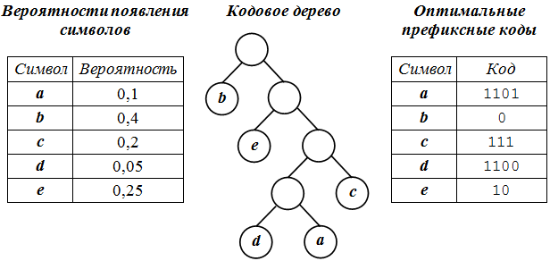

---
## Front matter
lang: ru-RU
title: Метод сжатия по Хаффману. Код Хэмминга.
author:
  - Кубасов В.Ю., 1132249516
institute:
  - НФИмд-01-24
date: 11 сентября 2024

## i18n babel
babel-lang: russian
babel-otherlangs: english

## Formatting pdf
toc: false
toc-title: Содержание
slide_level: 2
aspectratio: 169
section-titles: true
theme: metropolis
header-includes:
 - \metroset{progressbar=frametitle,sectionpage=progressbar,numbering=fraction}

## Fonts
mainfont: IBM Plex Serif
romanfont: IBM Plex Serif
sansfont: IBM Plex Sans
monofont: IBM Plex Mono
mathfont: STIX Two Math
mainfontoptions: Ligatures=Common,Ligatures=TeX,Scale=0.94
romanfontoptions: Ligatures=Common,Ligatures=TeX,Scale=0.94
sansfontoptions: Ligatures=Common,Ligatures=TeX,Scale=MatchLowercase,Scale=0.94
monofontoptions: Scale=MatchLowercase,Scale=0.94,FakeStretch=0.9
mathfontoptions:
---

# Вводная часть    

Актуальность    

- Кодирование информации используется повсеместно
- Исследования в поисках лучшего метода в узкой области и в общем спектре до сих пор ведутся    

 Цель работы:    
 - Исследовать актуальные и основные алгоритмы кодирования информации     

 Задачи работы:    
 - Изучить алгоритм Хаффмана для сжатия информации
 - Изучить алгоритм Хэминга для формирования самопроверяющегося кода    

# Классический алгоритм Хаффмана

1. Итерируемся по всему тексту, подсчитывая количество раз, которое определённый символ нам встретился.
2. Формируем список символов, сортируя его по количеству каждого символа в порядке возрастания - это наши будущие листья бинарного дерева.
3. Начинаем строить дерево. На каждой итерации выбираем 2 узла с наименьшим значением (частотой). Для них создаём родительский узел, значением которого выступает сумма значение дочерних узлов. Сами дочерние узлы из нашего списка удаляем, а вместо них вносим только что сформированный узел.
4. Повторяем предыдущий пункт, пока в списке не останется всего лишь один узел (корень). На этом моменте дерево сформировано. Таким образом, путь до самых частовстречающихся символов будет самым коротким, а, следовательно, будет иметь наименьший код.
5. Формируем коды для каждого символа, начниая с корня (например, рекурсивно обходя дерево). Где код каждого дочернего левого узла будет кодом родителя с добавлением нуля, а код правого - с добавлением единицы.
6. Далее формируем новый файл, кодируя символы по имеющемуся дереву (сформировав словарь где ключ - сам символ, а значение - код). В самое начало исходного файла помещаем таблицу частотностей символов. Таким образом, при декодировании сжатого файла программа сможет построить идентичное дерево и однозначно декодировать полученный файл.

# Классический алгоритм Хаффмана

# Алгоритм Хэмминга

. Пусть исходное сообщение - 16 бит.
2. На каждую позицию, с порядковым номером, равным степени двойке вставляет контрольный бит (пока что равный нулю).
3. Каждый такой контрольный бит с порядковым номером N (начиная с 1) отвечает за следующие N символов через каждые N символов начиная с N.  
На рисунке контрольные биты выделены красным, крестиками выделены биты, за которые они отвечают.
4. Далее просчитываем значение контрольного бита: если в его области ответственности нечетное количество единиц, то контрольный бит - единица.
5. На принимающей стороне контрольные биты заново высчитываются. Если контрольные биты не совпадают - ищем ошибку. Найти достаточно просто: нужно сложить порядковые номера всех бит, которые не совпали. Это и будет "битый" бит.

# Алгоритм Хэмминга

  

# Выводы

1. Разобрали основные алгоритмы кодирования информации
2. Исследовали необходимость использования кодирования в современном мире

