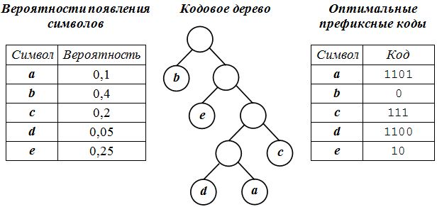

---
## Front matter
title: "Доклад"
subtitle: "по теме \"Метод сжатия по Хаффману. Код Хэмминга.\""
author: "Кубасов Владимир Юрьевич"

## Generic otions
lang: ru-RU
toc-title: "Содержание"

## Bibliography
bibliography: bib/cite.bib
csl: pandoc/csl/gost-r-7-0-5-2008-numeric.csl

## Pdf output format
toc: true # Table of contents
toc-depth: 2
lof: true # List of figures
lot: false # List of tables
fontsize: 12pt
linestretch: 1.5
papersize: a4
documentclass: scrreprt
## I18n polyglossia
polyglossia-lang:
  name: russian
  options:
	- spelling=modern
	- babelshorthands=true
polyglossia-otherlangs:
  name: english
## I18n babel
babel-lang: russian
babel-otherlangs: english
## Fonts
mainfont: IBM Plex Serif
romanfont: IBM Plex Serif
sansfont: IBM Plex Sans
monofont: IBM Plex Mono
mathfont: STIX Two Math
mainfontoptions: Ligatures=Common,Ligatures=TeX,Scale=0.94
romanfontoptions: Ligatures=Common,Ligatures=TeX,Scale=0.94
sansfontoptions: Ligatures=Common,Ligatures=TeX,Scale=MatchLowercase,Scale=0.94
monofontoptions: Scale=MatchLowercase,Scale=0.94,FakeStretch=0.9
mathfontoptions:
## Biblatex
biblatex: true
biblio-style: "gost-numeric"
biblatexoptions:
  - parentracker=true
  - backend=biber
  - hyperref=auto
  - language=auto
  - autolang=other*
  - citestyle=gost-numeric
## Pandoc-crossref LaTeX customization
figureTitle: "Рис."
tableTitle: "Таблица"
listingTitle: "Листинг"
lofTitle: "Список иллюстраций"
lotTitle: "Список таблиц"
lolTitle: "Листинги"
## Misc options
indent: true
header-includes:
  - \usepackage{indentfirst}
  - \usepackage{float} # keep figures where there are in the text
  - \floatplacement{figure}{H} # keep figures where there are in the text
---

# Введение{.unnumbered}  
Ещё в период развития первых компьютеров перед человечеством встала очередная проблема. Она затрагивала ограничения на предельные объемы памяти на накопителях и скорости передачи информации.   
Во всех существующих таблицах кодировки, кодировки палитры цветов и т.д. для каждого из вариантов используется одинаковое фиксированное количество бит. Данный вариант позволяет избавитсья от множества неудобств, однако с точки зрения эффективности данные можно хранить и по-другому.   
Преобразование первичного файла (например, текстового в кодировке ASCII) в файл, в котором информация (полная или частичная) будет сохранена, однако имеющий меньший размер называется __сжатием__.

# Цель и задачи

Целью данной работы является изучение области использования кодирования в настоящем времени в компьютерной науке.    
Задачи:
1. Изучить современные алгоритмы кодирования
2. Разобрать наиболее популярные алгоритмы кодирования информации.

# Основные моменты алгоритмов сжатия
## Классификация алгоритмов сжатия
Во-первых, алгоритмы сжатия можно разделить на[@истомин2005классификация]:
1. Алгоритмы сжатия без потерь
2. Алгоритмы с потерями

Если с алгоритмами без потерь всё предельно просто, то зачем нужны алгоритмы, допускающие потери информации? Если мы возьмём текст, то замена определённых символов может вести к искажению понимания или банальной бессмыслице, однако в тексте они и не используется (по крайней мере такой информации не было найдено).
Допустить потерю малой части информации возможно, например, при сжатии изображений, так, например, работает jpeg-формат[@дружинин2007гибритный], mp3 формат для аудио и другие. В общем, потерять информацию мы можем, когда оставшаяся информация гарантирует избыточность этой информации, гарантирует, что наши допуски не скажутся на восприятии кодированной и в последствие декодированной информации    
Также выделяют и другие типы алгоритмов, классификация которых основана на принципе действия данных алгоритмов. Например, алгоритмы сжатия длин серии (замена последовательности одинаковых единиц информации на более короткую с указанием длины), алгоритмы замены по словарю (т.е. нахождение длинных или частовстречающихся слов на метку, а также добавление словаря в файл) и другие.    
Здесь появляется вопрос: какой из алгоритмов окажется эффективнее всего? До сих пор появляются публикации с предложениями новых алгоритмов сжатия, но в большинстве своём они определены для конкретного спектра файлов. Актуальность проблемы эффективности таких алгоритмов заключается в том, что мы не можем заранее определить, какой из них окажется эффективнее в большинстве своём. Одни алгоритмы могут достаточно успешно использоваться в библиотеках англоязычной литературы, другие - в системах математического моделирования.

## Использование алгоритмов сжатия

Помимо вышеперечисленных использований в виде сжатия текста, изображений, аудиофайлов, стоит отметить, что сжатие данных используется практически везде.     
Любая передача данных по сети обёрнута сжатием и "разжатием" информации. В данном случае уменьшение времени передачи данных важнее, чем затраты на процессы кодирования и декодирования самих данных ввиду возможных обрывов связи, а так же издержками сети (здесь стоит вспомнить скорости передачи первых интернет сетей, arpanet в текущем контексте не учитываем). Даже сейчас практически и экономически выгоднее отправлять сжатый файл, нежели исходный. С учётом сжатия передаваемой информации значительно повышается устойчивость сети ввиду уменьшения нагрузки на неё.    
Размеры существующих накопителей до сих пор сильно ограничены (по крайней мере мы не можем позволить хранить видеофайлы без сжатия, однако находятся энтузиасты). Если в повседневном варианте сжатие на 50-70% будет превосходным результатом, то, например, при резервном копировании, которое может происходить в больших компаниях ежедневно (если не чаще). Хранить терабайты log-файлов или записи личных переписок всех пользователей IPhone предпочтительно в минимальном объеме информации, и, если возможно, кодировать информацию в несколько циклов, повышая эффективность сжатия за цикл на 1-2%, тратя драгоценные минуты дорогостоящего оборудования.

## Дешифрование

Помимо сжатия информации важный момент определяется дешифрованием информации. В любом алгоритме мы должны иметь возможность однозначно дешифровать информацию. Здесь используется давно знакомое "условие Фано" или префиксное правило. Так как в большинстве своём алгоритмы используют замену на меньший размер информации, то вытекает закономерность: мы можем однозначно дешифровать код при условии, что начало код одной последовательности (или символа) не должен начинаться с уже существующего кода.

# Сжатие по Хаффману

## Классический алгоритм Хаффмана

Данный алгоритм является основополагающим, даже спустя десятки лет. Плюс его заключается во-первых в независимости от исходной информации. Алгоритм не привязан, например, к словарю. До сих пор метод Хаффмана является достаточно эффективным и используется современными архиваторами данных.

Обобщая, алгоритм заключается в создании таблицы частот используемых единиц информации (символов, байт или других), построении дерева кодирования согласно префиксному правилу. При этом мы используем код переменного размера для каждого символа, чем чаще символ встречается, тем меньше у него будет код.

Алгоритм Хаффмана[@акимушкин2013алгоритм] можно представить в виде следующих действий (пусть имеется некоторый текст для сжатия):

1. Итерируемся по всему тексту, подсчитывая количество раз, которое определённый символ нам встретился.
2. Формируем список символов, сортируя его по количеству каждого символа в порядке возрастания - это наши будущие листья бинарного дерева.
3. Начинаем строить дерево. На каждой итерации выбираем 2 узла с наименьшим значением (частотой). Для них создаём родительский узел, значением которого выступает сумма значение дочерних узлов. Сами дочерние узлы из нашего списка удаляем, а вместо них вносим только что сформированный узел.
4. Повторяем предыдущий пункт, пока в списке не останется всего лишь один узел (корень). На этом моменте дерево сформировано. Таким образом, путь до самых частовстречающихся символов будет самым коротким, а, следовательно, будет иметь наименьший код.
5. Формируем коды для каждого символа, начниая с корня (например, рекурсивно обходя дерево). Где код каждого дочернего левого узла будет кодом родителя с добавлением нуля, а код правого - с добавлением единицы.
6. Далее формируем новый файл, кодируя символы по имеющемуся дереву (сформировав словарь где ключ - сам символ, а значение - код). В самое начало исходного файла помещаем таблицу частотностей символов. Таким образом, при декодировании сжатого файла программа сможет построить идентичное дерево и однозначно декодировать полученный файл.

Получаемые структуры в результате алгоритма кодирования Хаффмана:     

    

Для декодирования:

1. Строим дерево, аналогично предыдущему алгоритму.
2. Начинаем чтение битовой последовательности, продвигаясь по дереву. Если встречаем ноль - продвигаемся к левому дочернему узлу, если единицу - к правому.
3. Когда достигаем листа дерева - записываем символ в новый файл.
4. Итерируясь по каждому биту таким образом получаем однозначно декодированный файл без потери информации.

Ввиду относительной простоты данного алгоритма (и в целях экономии времени) листинг данного алгоритма приводить не буду. В большинстве своём описание ноды дерева занимает больше исходного кода, нежели алгоритм кодирования.    

В этом алгоритме появлется существенный недостаток - таблица частотности, которую мы обязаны хранить в начале файла. При условии большого текстового файла на одном языке проблем не будет, однако, с ростом таблицы и уменьшением полезной информации в файле падает эффективность ввиду таблицы частот. Можем ли мы формировать такую таблицу по мере чтения файла? Как оказалось, такое возможно.

## Адаптивный алгоритм Хаффмана[@кудрина2015адаптивный]

Отличие лишь в том, что таблица частот формируется в процессе обработки самого файла. Так же используется бинарное дерево, однако алгоритм приобретает существенные изменения:

1. Начинаем итерацию по файлу. Первый символ, которого ещё не было - просто записываем его в итоговый и добавляем в дерево поддерево из 3 элементов: родительский узел, левый дочерний - узел заглушка (или escape - символ), правый дочерний - наш текущий узел.
2. Далее для дерева мы обязаны соблюдать следующее правило: когда встречаем символ, который уже был ранее - увеличиваем значение частоты данного символа.
3. Если встречаем новый символ - формируем для него тройку узлов, родительский узел в этой тройке замещает escape символ в дереве. Записываем в файл новый символ, перед ним указывая код escape - символа, который мы заместили. После этого пересчитываем вес родительских узлов.
4. Если при пересчёте значений узлов оказалось, что значение левого узла больше значения правого узла (одного родительского узла) меняем местами дочерние узлы (т.е. левый узел становится правым, а правый - левым, сохраняя всю дочернюю структуру).

Таким образом мы избавились от таблицы частотности символов, сохраняя однозначное декодирование.

# Код Хэмминга[@бояринов2008самопроверяющиеся]    

Возвращаясь к началу доклада, вспомним сеть. Данный алгоритм не является алгоритмом сжатия данных. Его суть заключается в создании кода, который можно восстановить в случае ошибки. Например, во-время передачи пакета из-за помех мы получили изменённый бит. Проблема в том, что мы можем узнать, что бит был изменён только после сравнения с исходным пакетом. Задача состоит в том, чтобы найти алгоритм, способный создавать "самовосстанавливающиеся" пакеты, т.е. такой алгоритм, следуя которому мы могли бы понять, что произошла ошибка передачи, и понять, где эта ошибка допущена.     
Такой алгоритм называется кодом Хемминга. Если кратко, суть его заключается во вставке контрольных битов в некоторое количество бит, кратное двойке (16, для простоты).      

Алгоритм:
1. Пусть исходное сообщение - 16 бит.
2. На каждую позицию, с порядковым номером, равным степени двойке вставляет контрольный бит (пока что равный нулю).
3. Каждый такой контрольный бит с порядковым номером N (начиная с 1) отвечает за следующие N символов через каждые N символов начиная с N. Более подробно:    
    
На рисунке контрольные биты выделены красным, крестиками выделены биты, за которые они отвечают.
4. Далее просчитываем значение контрольного бита: если в его области ответственности нечетное количество единиц, то контрольный бит - единица.
5. На принимающей стороне контрольные биты заново высчитываются. Если контрольные биты не совпадают - ищем ошибку. Найти достаточно просто: нужно сложить порядковые номера всех бит, которые не совпали. Это и будет "битый" бит.

Реализация данного алгоритма подразумевает, что ошибка может быть максимум одна на весь пакет. Однако, в нашем мире используются более сложные алгоритмы, позволяющие находить более одной ошибки.

# Заключение
В данной работе были изложены области применения алгоритмов кодирования, а так же пояснена необходимость их использования в современных системах. Разобраны наиболее популярные алгоритмы сжатия и защиты информации, приведены описания данных алгоритмов.

# Список литературы{.unnumbered}

::: {#refs}
:::
 